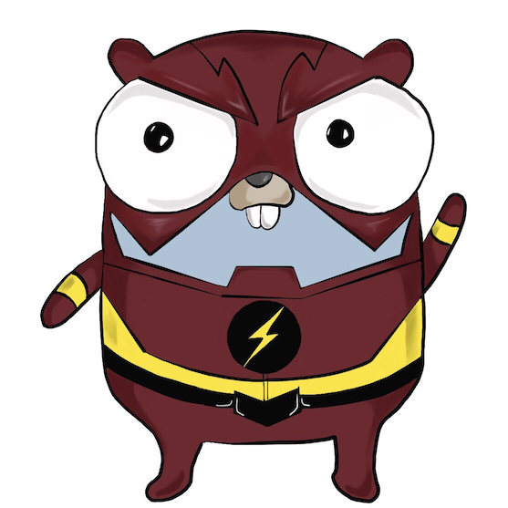

# Serverless Golang

> Gopher inspired by Ashley McNamara (@ashleymcnamara) and Renee French artworks.

[serverless](https://serverless.com/) examples using `golang` and `AWS Lambda`. This is different to other `node` shim based frameworks
because it is powered by low latency `python` runtime:

- [eawsy/aws-lambda-go-shim](https://github.com/eawsy/aws-lambda-go-shim)
- [eawsy/aws-lambda-go-net](https://github.com/eawsy/aws-lambda-go-net)

## Features
- works with AWS Lambda event sources or API Gateway HTTP requests.
- go vendor support with default [dep](https://github.com/golang/dep). Can be swapped out easily.
- use `docker` for easy testing and ensure consistent dependencies across `golang`, `python` and `serverless`

## Usage
Prerequisites:
- installed `serverless`, `go`, `make` and docker
- set `$GOPATH` and your new project must reside in `$GOPATH/src/path/your-app`

See each individual example for detailed instructions:

- [Serverless Golang Event](https://github.com/yunspace/serverless-golang/blob/master/examples/aws-golang-event/README.md)
- [Serverless Golang Net](https://github.com/yunspace/serverless-golang/blob/master/examples/aws-golang-net/README.md)

## Clients
Currently used by [amaysim Australia](https://www.amaysim.com.au/) to build
strategic Microservices. Serving 1M+ customers with up to 500CCU.
